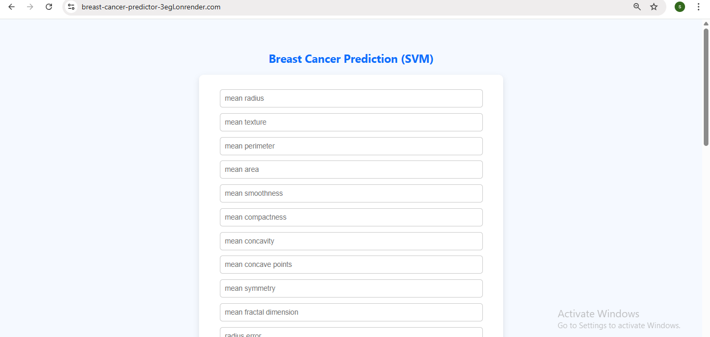
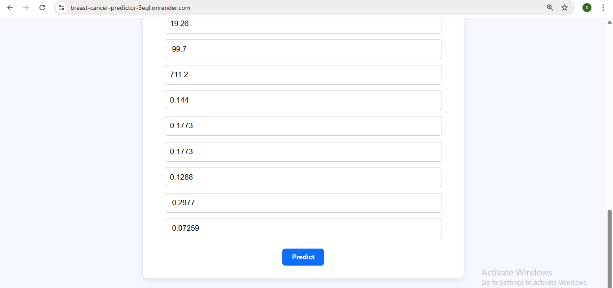
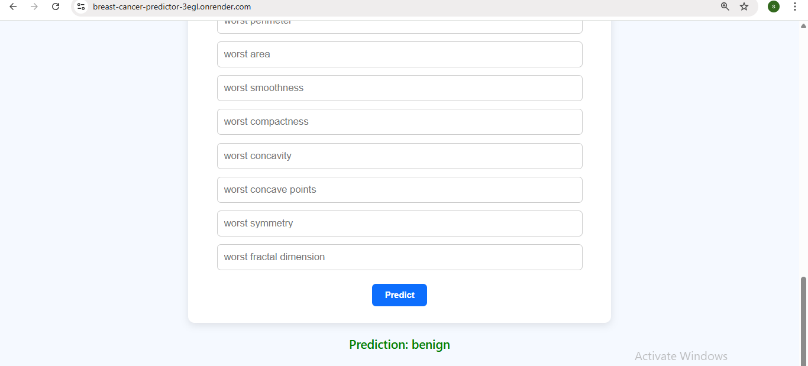

# Breast-cancer-predictor

The model used is a **Support Vector Machine (SVM) classifier** with a linear kernel, trained on the Breast Cancer Wisconsin Diagnostic Dataset. It is designed to predict whether a tumor is malignant (cancerous) or benign (non-cancerous) based on 30 numerical medical features, such as radius, texture, smoothness, and area of cell nuclei in digitized images of breast mass samples.

---

## Features

- Predicts breast cancer as benign or malignant using 30 medical input features.
- Trained with a Support Vector Machine (SVM) using a linear kernel.
- Clean and responsive web interface built with Flask and HTML/CSS.
- Deployed on Render for live access and real-time predictions.


---

## Prerequisites

Make sure the following are installed:

- Python 3.7 or higher installed
- Git installed and configured
- Basic knowledge of Python and Flask
- A GitHub account (for code hosting)
- Render account (for deployment)

---

## Installation

### 1. Clone the repository

```
git clone https://github.com/sandhiya0147/breast-cancer-predictor.git
cd breast-cancer-predictor
```

### 2. Install dependencies

```
pip install -r requirements.txt
```

---

## Running the Application

Start the Flask development server:

```
python app.py
```

Then open your browser and go to:

```
http://127.0.0.1:5000
```

---

## How It Works

- Loads the Breast Cancer dataset and trains an SVM classifier using 30 input features.
- Saves the trained model, feature names, and target labels using joblib.
- User enters values for all 30 features in the web form built with Flask.
- The app passes the inputs to the saved model and gets a prediction (benign or malignant).
- The result is displayed instantly on the web page for the user.

---

## File Structure

```
project-root/
├── assets/
├── static/
│   └── style.css
├── templates/
│   └── index.html
├── Procfile
├── README.md
├── app.py
├── data.csv
├── feature_columns.pkl
├── model.pkl
├── model_train.py
├── requirements.txt
└── target_names.pkl
```

---

## Future Improvements

- Add input validation and error handling for more reliable user interaction.
- Display model accuracy and confidence score alongside predictions.
- Allow switching between multiple ML models (e.g., SVM, Random Forest).
- Optimize the form UI for mobile and touchscreen users.
- Store user inputs and predictions in a database for analysis and audit.

---


## Step-by-Step Guide: How to Use the Movie Interest Predictor


### Step 1: Input Form
  

### Step 2: Filled Form 
  

### Step 3: Prediction Result


---

## Live Demo

[Click here to view the deployed app](https://breast-cancer-predictor-3egl.onrender.com)

---
